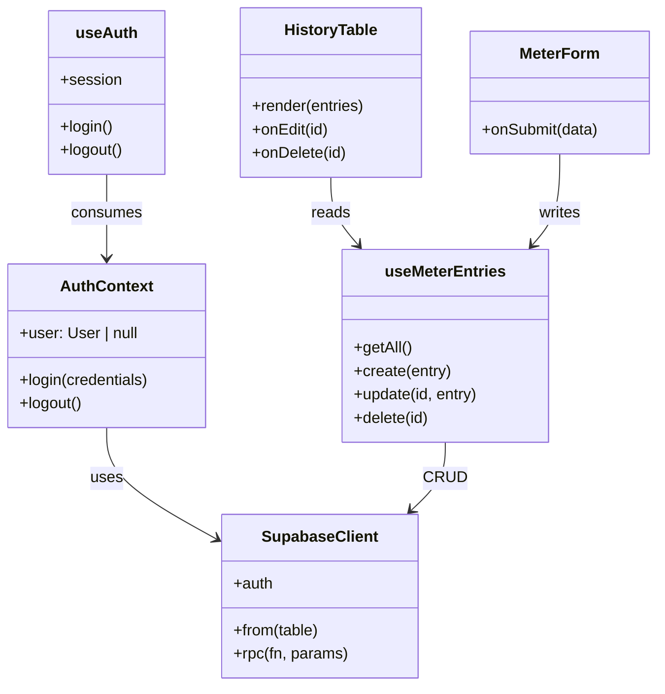

# CLAUDE.md

This file provides guidance to Claude Code (claude.ai/code) when working with code in this repository.

## Common Development Commands

- **Start the dev server**: `npm run dev` – Vite with hot‑module replacement.
- **Build for production**: `npm run build` – runs `tsc -b` then Vite bundling.
- **Preview a production build**: `npm run preview` – serves the `dist` folder.
- **Lint**: `npm run lint` – ESLint with the project's TypeScript config.
- **Type‑check only**: `tsc --noEmit` – validates TypeScript without emitting files.
- **Run tests** (if a test framework is added later): `npm test`; for a single test file: `npm test -- <path>`.

## High‑Level Architecture

### Entry Point & Root
- **`src/main.tsx`** – mounts the React app into the DOM and injects Tailwind styles.
- **`src/App.tsx`** – coordinates authentication, settings, UI layout and data flow. It composes many custom hooks and UI components.

### Authentication Layer
- **`src/context/AuthContext.tsx`** – React context exposing auth state and actions.
- **`src/hooks/useAuth.ts`** – handles login/logout against Supabase, persists session in `localStorage`, and validates input.
- **`src/components/LoginModal.tsx`** – modal UI for entering credentials.

### Data Layer (Supabase)
- **`src/lib/supabase.ts`** – creates a Supabase client from environment variables.
- Custom hooks encapsulate all data operations:
  - **`useMembers`** – fetches the list of members.
  - **`useMeterEntries`** – CRUD for electricity meter entries, night‑shift auto‑entry creation, and real‑time updates via Supabase channels.
  - **`useMemberTotals`** – aggregates per‑member usage for a selected month.
  - **`useMemberShiftBreakdown`** – detailed day/night shift breakdown per member.
  - **`useMonthlyStats`** – provides month‑level statistics (e.g., totals, cost).
  - **`useSettings`** – reads global app settings such as the per‑unit rate.
  - **`useDarkMode`** – toggles UI dark theme.
  - **`useToast`** – centralised toast notification system.

### UI Components (presentational)
- **Header** – shows role, total units/cost, dark‑mode toggle, and logout/login controls.
- **SummaryBar** – displays aggregated totals for the selected month.
- **MemberCards** – renders a card per member with usage summary.
- **MeterForm** – form for logging opening/closing meters; auto‑creates night‑shift entries when applicable.
- **HistoryTable** – paginated table of all meter entries with edit/delete actions respecting `isEditor`.
- **Charts** – usage trends visualised with Chart.js.
- **Toast**, **LoadingSpinner**, **ViewOnlyNotice** – UI helpers for feedback and state.

### Utilities & Types
- **`src/utils/calculations.ts`** – pure functions (`calculateGrandTotals`, etc.) used throughout the app.
- **`src/utils/formatters.ts`**, **`src/utils/validators.ts`** – helper functions for date/number formatting and input validation.
- **`src/types/app.types.ts`** – central TypeScript interfaces (`Member`, `Role`, `MeterEntry`, etc.).

### Styling
- Tailwind CSS configured via **`tailwind.config.cjs`** and integrated with Vite using `@tailwindcss/vite`.

## Project Conventions

- All files are **TypeScript** and use **React functional components**.
- Business logic lives in **custom hooks** under `src/hooks/`; UI components focus on rendering only.
- Authentication state is provided through a **React context** (`AuthContext`).
- Dates are stored as **UTC ISO strings**; conversion to Indian Standard Time (IST) happens in the UI where required.
- The UI respects the `isEditor` flag to conditionally render editing controls.
- Supabase is the sole backend; queries are performed with the generated client (`src/lib/supabase.ts`).
- Real‑time updates use Supabase's `channel` API (e.g., shift‑breakdown and meter‑entry listeners).

## README Highlights & ESLint Configuration

- The repository is a **Vite + React + TypeScript** starter.
- It uses `@vitejs/plugin-react` for fast HMR.
- Recommended ESLint extensions (from the README) include `eslint-plugin-react-x` and `eslint-plugin-react-dom`. The project already ships an `eslint.config.js` that can be extended.
- No additional Cursor or Copilot rules were found.

## High‑Level Design (HLD)

The system follows a **client‑centric SPA** architecture with a thin server layer (Supabase). Core responsibilities:
1. **Authentication** – Managed by Supabase auth, exposed via `AuthContext`.
2. **Data Access** – All CRUD operations are encapsulated in custom React hooks that call Supabase RPCs or direct table queries.
3. **State Management** – Local React state combined with context for global auth and UI preferences (dark mode, toast notifications).
4. **Real‑time Sync** – Each hook that displays mutable data (e.g., meter entries) subscribes to a Supabase realtime channel to push updates instantly to the UI.
5. **Presentation Layer** – Tailwind‑styled, component‑driven UI with a clear separation between container‑style logic (hooks) and presentational components.

### Component Interaction Flow
```
User Interaction → UI Component (e.g., MeterForm) → Hook (useMeterEntries) → Supabase → Realtime Channel → Hook updates → UI refresh
```

## Low‑Level Design (LLD) & Class Diagram



## API Documentation (Supabase Endpoints)

| Table / RPC | HTTP Method | Path (Supabase) | Description |
|-------------|-------------|----------------|-------------|
| `members` | GET | `/rest/v1/members` | List all members. Supports filtering by `role`.
| `meter_entries` | GET | `/rest/v1/meter_entries` | Retrieve meter entries; query params `date_gte`, `date_lte` for range.
| `meter_entries` | POST | `/rest/v1/meter_entries` | Create a new entry. Payload includes `member_id`, `type` (opening/closing), `reading`, `timestamp`.
| `meter_entries` | PATCH | `/rest/v1/meter_entries?id=eq.{id}` | Update a specific entry (e.g., correction).
| `meter_entries` | DELETE | `/rest/v1/meter_entries?id=eq.{id}` | Delete an entry.
| RPC `create_night_shift_entry` | POST | `/rpc/create_night_shift_entry` | Server‑side function that auto‑creates a night‑shift entry at 22:00 IST if none exists.
| RPC `calculate_monthly_totals` | POST | `/rpc/calculate_monthly_totals` | Computes aggregated units and cost for a given month; returns `{memberId, totalUnits, totalCost}`.

All API calls require the `Authorization` header with the Supabase JWT token obtained after login.

## Guidance for Future Claude Instances

1. **Adding data‑driven features** – create a new hook in `src/hooks/` that encapsulates Supabase interaction, then consume it from a component.
2. **Pure calculations** – place them in `src/utils/` and keep them side‑effect‑free.
3. **Extending UI** – follow the existing pattern: small presentational components in `src/components/`, stateful logic in hooks, and keep `App.tsx` thin.
4. **Styling** – prefer Tailwind utility classes; extend `tailwind.config.cjs` only when necessary.
5. **Testing** – if a test framework is introduced, locate tests next to the file they verify (e.g., `Component.test.tsx`).
6. **ESLint** – update `eslint.config.js` for new rule sets; ensure any new files are covered by the `tsconfig.app.json` project reference.
7. **Real‑time behavior** – when adding new tables to Supabase, remember to add a corresponding realtime channel subscription if UI needs live updates.
